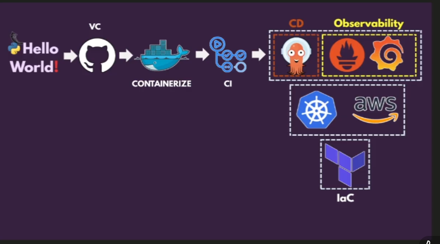

# End TO End Project 

GitHub
Docker
Github action ( CI)

Argo CD

observability
promethesus + grafana

Kubernater + GCP + terraform

Phase 1 Set-up the Environment for start-up

Install docker , git, kubectl, Helm, python, pip, aws cli, terraform.

Phase 2 

 
